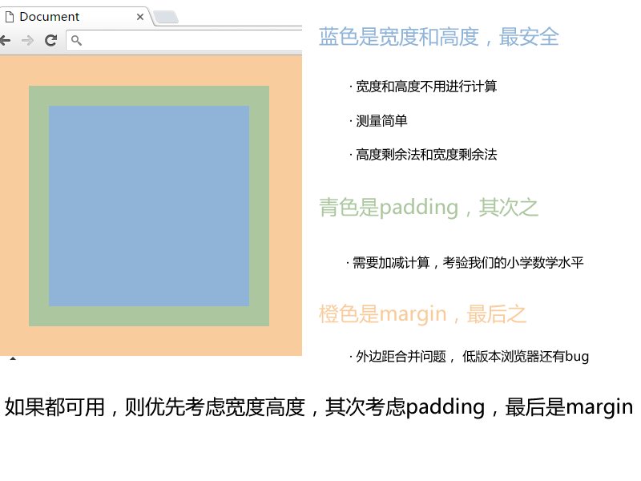

# 京东项目

## 京东项目介绍
项目名称：京东网仿制
项目描述：京东首页公共部分的头部和尾部制作，京东首页中间部分。

## 设计目标
- 保证浏览器 ie7及以上, 火狐, 360, safari，chrome等。
- 熟悉CSS+DIV布局，页面的搭建工作
- 了解常用电商类网站的布局模式

## 默认样式说明
normalize.css只是一个很小的CSS文件，但它在默认的HTML元素样式上提供了跨浏览器的高度一致性。
相比于传统的CSS reset，Normalize.css是一种现代的、为HTML5准备的优质替代方案。
Normalize.css现在已经被用于Twitter Bootstrap、HTML5 Boilerplate、GOV.UK、Rdio、CSS Tricks以及许许多多其他框架、工具和网站上。

## 技术栈
HTML5结构 + CSS3布局

## 目录说明
要实现结构和样式相分离的设计思想。 根目录下有这4个文件（目录）。
| 名称     | 说明                 |
| ------ | ------------------ |
| css    | 用于存放CSS文件          |
| images | 用于存放图片             |
| index  | 京东首页 HTML          |
| js     | 用于后期存放javascript文件 |

# 运用知识点

##  引入ico图标
代码：  
`<link rel="shortcut icon" href="favicon.ico" type="image/x-icon"/>`
注意： 
1. 它不是iconfont字体
2. 位置是放到 head 标签中间
3. 后面的type="image/x-icon"属性可以省略
4. 为了兼容性，请将favicon.ico这个图标放到根目录下

## 转换ico图标
我们可以自己做的图片，转换为ico图标，以便放到我们站点里面。 http://www.bitbug.net/

## 网站优化三大标签
SEO是由英文Search Engine Optimization缩写而来，中文意译为“搜索引擎优化”！
SEO是指通过对网站进行站内优化、网站结构调整、网站内容建设、网站代码优化等)和站外优化，从而提高网站的关键词排名以及公司产品的曝光度。
简单的说就是，把产品做好，搜索引擎就会介绍客户来。我们现在阶段主要进行站内优化。

### 网页title标题
title具有不可替代性，是我们的内页第一个重要标签，是搜索引擎了解网页的入口，和对网页主题归属的最佳判断点。
建议：
首页标题：网站名（产品名）- 网站的介绍 
例如：
京东(JD.COM)-综合网购首选-正品低价、品质保障、配送及时、轻松购物！
小米商城 - 小米5s、红米Note 4、小米MIX、小米笔记本官方网站

### Description网站说明
对于关键词的作用明显降低，但由于很多搜索引擎，仍然大量采用网页的MATA标签中描述部分作为搜索结果的“内容摘要”。
就是简要说明我们网站的主要做什么的。我们提倡，Description作为网站的总体业务和主题概括。

### Keywords关键字
Keywords是页面关键词，是搜索引擎关注点之一。Keywords应该限制在6～8个关键词左右。

## 顶部（快捷菜单）所用知识点
| 知识点                 | 说明                                       |
| ------------------- | ---------------------------------------- |
| 通栏的盒子               | 不用给宽度  默认为 100% &nbsp;但是加了浮动和定位的盒子需要 添加 100% |
| 盒子居中对齐              | margin: auto;  注意必须有宽度的块级元素，文字水平居中对齐是 text-align:center; |
| 行高会继承               | 文字性质的，比如 颜色、文字大小、字体、行高等会继承父级元素           |
| 浮动元素、固定定位，绝对定位会模式转换 | 具有行内块特性，比如一行放多个，有高度和宽度，如果没有指定宽度，则会根据内容多少撑开。 |

### 网页布局稳定性

### 宽度剩余法

| 知识点    | 说明                                       |
| ------ | ---------------------------------------- |
| 浮动元素特性 | 1. 浮动可以让多个元素同一行显示 2. 浮动的元素是顶部对齐          |
| logo优化 | text-indent: -20000px; 隐藏文字， 背景图片        |
| 清除浮动   | 清除浮动的目的就是为了解决父亲高度为0的问题                   |
| 鼠标样式   | cursor: pointer;小手      cursor: move;四角箭头     cursor: text;插入光标     cursor: default;小白 |
| 不允许换行  | white-space: nowrap;                     |

## nav导航栏所用知识点
| 名称      | 说明                                       |
| ------- | ---------------------------------------- |
| 边框底侧    | border-bottom: 2px solid #ccc;           |
| 定位重点    | 绝对定位不占位置  相对定位占有位置                       |
| 标签语义化dl | dl也是块级元素 dt 是 定义标题  dd 是定义描述，dd是围绕这dt来描述的，也就是说，dd算是dt 的解释说明详细分解。 |
| 标题标签h   | 尽量少用h1，可以多用h2和h3等标签                      |

### 固定定位的盒子靠近版心右侧对齐
跟绝对定位的盒子居中对齐原理差不多。
left 50%   然后 margin-left  版心宽度一半。

## 焦点图部分所用知识点
| 名称   | 说明                               |
| ---- | -------------------------------- |
| 圆角矩形 | border-radius: 左上角 右上角 右下角  左下角。 |
负值自己的宽度一半（固定定位也是如此）

## 背景半透明
background: rgba(r,g,b,alpha);
r,g,b 是红绿蓝的颜色，  alpha 是透明度的意思，取值范围是 0~1 之间。

## 页面底部所用知识点
| 名称          | 说明                                       |
| ----------- | ---------------------------------------- |
| 绝对定位的盒子居中对齐 | 盒子 left 50%  然后通过 margin 负值自己的宽度一半（固定定位也是如此） |

